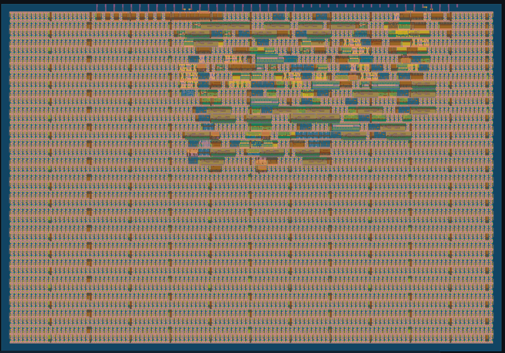

# 7-bit ALU — Serial Input / Parallel Output

**Bootcamp IC Design & Fabrication — IEEE OpenSilicon / IEEE CASS UTP 2026**

---

## Overview

This project implements a **7-bit Arithmetic Logic Unit (ALU)** for fabrication
on TinyTapeout (shuttle SKY26a, PDK sky130A).

The system receives two 7-bit operands and a 3-bit operation code **serially**
through a single input pin (`ui_in[0]`), using LSB-first format. The 8-bit
result is presented **in parallel** on `uo_out[7:0]` once the computation is
complete.

---

# 2D Preview 



### Serial input protocol

### Serial input protocol

## How it works

### Serial input protocol

Data is sent bit by bit through `ui_in[0]`, synchronised with the rising edge
of `clk`, in the following order:

| Clock cycle(s) | Data received                        |
|----------------|--------------------------------------|
| 1 .. 7         | Operand A [6:0], LSB first           |
| 8 .. 14        | Operand B [6:0], LSB first           |
| 15 .. 17       | Opcode [2:0], LSB first              |
| 18 (automatic) | FSM computes and presents the result |

### Supported operations

| op[2:0] | Operation | Expression          |
|---------|-----------|---------------------|
| `000`   | ADD       | `result = A + B`    |
| `001`   | AND       | `result = A & B`    |
| `010`   | OR        | `result = A \| B`   |
| `011`   | XOR       | `result = A ^ B`    |
| `100`   | SUB       | `result = A - B`    |

> **Bit 7 of the result:** In addition it indicates *carry-out*; in subtraction
> it indicates *borrow* (two's complement representation).

### State machine (FSM)

The design uses a 3-state FSM:

```
S_RECV ──(17 bits received)──► S_CALC ──(1 cycle)──► S_DONE
   ▲                                                      │
   └──────────────────────(rst_n = 0)────────────────────┘
```

- **S_RECV:** LSB-first serial capture using a shift-right shift register.
- **S_CALC:** Latch the combinational ALU result + assert Done for one cycle.
- **S_DONE:** Result stable on outputs; waits for `rst_n = 0` to restart.

---

## Pin map

### Inputs

| Pin      | Signal  | Description                                       |
|----------|---------|---------------------------------------------------|
| `ui[0]`  | Bit_in  | Serial data input (LSB first: A, B, opcode)       |
| `ui[7:1]`| —       | Unused                                            |
| `clk`    | CLK     | System clock (up to 50 MHz)                       |
| `rst_n`  | /RST    | Active-low reset — returns FSM to S_RECV          |

### Outputs

| Pin      | Signal       | Description                               |
|----------|--------------|-------------------------------------------|
| `uo[6:0]`| Data_out[6:0]| 7-bit result (LSB = `uo[0]`)              |
| `uo[7]`  | Data_out[7]  | Carry (ADD) or Borrow (SUB)               |
| `uio[0]` | Done         | One-cycle high pulse when result is ready |

---

## How to test

### Operating procedure

1. Assert reset: `rst_n = 0` for at least 2 clock cycles.
2. Release reset: `rst_n = 1`.
3. Send the 7 bits of **Operand A** through `ui[0]`, LSB first, one bit per rising edge.
4. Send the 7 bits of **Operand B** through `ui[0]`, LSB first.
5. Send the 3 bits of the **opcode** through `ui[0]`, LSB first.
6. Wait 1 additional clock cycle (automatic S_CALC transition).
7. Read the result on `uo_out[7:0]`.
8. Verify that `uio_out[0]` (Done) is `1` for exactly one clock cycle.

### Example: 20 + 30 = 50

```
Operand A = 20 = 7'b0010100  → send LSB first: 0,0,1,0,1,0,0
Operand B = 30 = 7'b0011110  → send LSB first: 0,1,1,1,1,0,0
Opcode    =  0 = 3'b000      → send LSB first: 0,0,0

Expected result: uo_out = 8'b00110010 = 50
Done = 1 on cycle 18
```

### Example: 10 - 30 (underflow in two's complement)

```
Operand A = 10, Operand B = 30, op = 3'b100
Result = (10 - 30) & 0xFF = (-20) & 0xFF = 0xEC = 236
Bit[7] = 1 indicates borrow (negative result in two's complement)
```

---

## External hardware

No external hardware is required for basic operation.

Optional hardware for demonstration:

- LEDs connected to `uo_out[7:0]` for result visualisation
- Push buttons for manual serial input and clock stepping
- Logic analyser for waveform inspection
- FPGA board or TinyTapeout DevKit